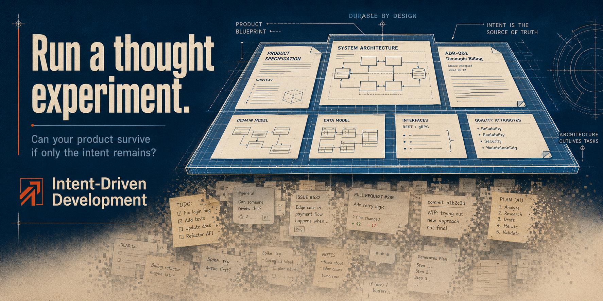

# Intent-Driven Development

<p align="center">
  
</p>

<p align="center">
  <strong>Durable product intent for disposable implementations.</strong>
</p>

Intent-Driven Development (IDD) is a lightweight alternative to heavyweight Spec-Driven Development workflows for AI-assisted software development.

IDD preserves the current truth about the product. Temporary plans, task lists, statuses, reviews, and implementation attempts stay temporary. Coding Agents work from the relevant intent, while Git preserves history.

## The Thought Experiment

> **Delete the implementation. Keep only the intent. Can a Coding Agent rebuild the product?**

IDD organizes product knowledge so the answer can move closer to **yes**.

## Why IDD?

- **One current source of product truth.** Intent documents describe what the product must do.
- **Fewer permanent artifacts.** Plans, task states, and reviews do not accumulate in the repository.
- **Lower context overhead.** Agents read relevant current intent instead of a growing history of workflow documents.
- **Git owns history.** Specifications stay current; Git records how they and the implementation changed.

## Quick Start

### Claude Code

```bash
claude plugin marketplace add DimonSmart/Intent-Driven-Development@marketplace
claude plugin install idd-intent@intent-driven-development
```

### Codex

```bash
codex plugin marketplace add DimonSmart/Intent-Driven-Development --ref marketplace
codex plugin add idd-intent@intent-driven-development
```

Open the target repository and initialize IDD:

```text
idd-project-init
```

Then describe what you need naturally. For example:

```text
Use idd-intent-brainstorm to help me clarify a feature that lets users compare two local folders without modifying either side.
```

## Use Cases

Open [IDD Use Cases](docs/using-idd.md) when you need to decide what to do next. It covers existing and new projects, product changes, implementation-only work, audits, verification, Factory, and deliberate IDD bypass.

## Verify Installation

After setup, [verify the marketplace, installed plugins, and repository initialization](docs/verify-installation.md).

## Updating IDD

IDD is actively developed, and new versions are released periodically. Refresh the marketplace and update the installed plugins to receive the latest workflows, fixes, and documentation.

[Update IDD to the latest version](docs/updating-idd.md)

## Two Explicit Plugins

```text
idd-intent    durable product memory
idd-factory   optional temporary implementation orchestration
```

`idd-intent` is the standalone core. Install `idd-factory` only when a task benefits from explicit multi-step execution and independent review.

## Documentation

- [IDD Use Cases](docs/using-idd.md)
- [Verify Installation](docs/verify-installation.md)
- [Updating IDD](docs/updating-idd.md)
- [Existing Project Guide](docs/existing-project.md)
- [New Project Guide](docs/new-project.md)
- [Methodology](docs/methodology.md)
- [Factory Workflow](docs/factory-workflow.md)
- [Factory Skills Reference](docs/factory-skills.md)

## License

MIT
